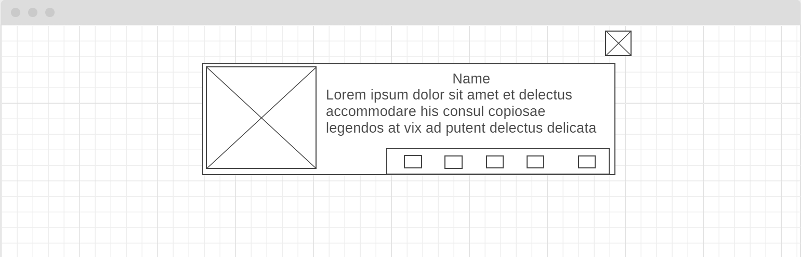

# dev-tools-review

## Introduction

A simple web application for developers to post reviews of the tools that they use (Languages, IDEs, peripherals, ...etc).

## WireFrame

[click on the link](https://wireframe.cc/UH83Tu)


## User Stories

-   As a user I should be able to add a new review.

-   As a user I want to be able to view a list of all reviews.

-   As a user I want to be able to edit an already added review.

-   As a user I should be able to delete any review item.

-   As a user I want to be asked to confirm after I click on the delete button.

-   As a suer I should be able to dlete all list items.

-   As a user I should be able to like/dislike reviews.

-   As a user I should be able to delete all disliked reviews.

## Technologies Used

1. ReactJs.

2. Express.

3. Axios.

4. Reactstrap.

5. ExpressJs.

6. MongoDb.

## Instructions

```bash
npm install
```

```bash
npm run start
```

for both the Server and Client projects
